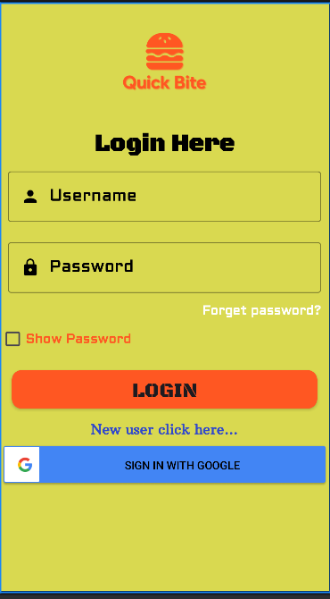
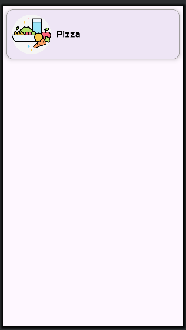
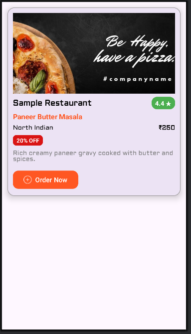
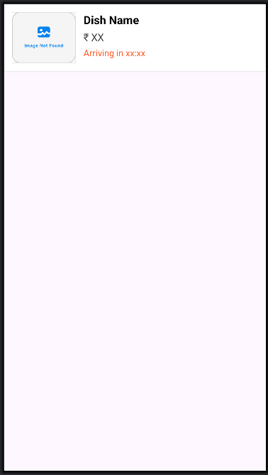

# 🍔 Quick Bite - Online Food Delivery App


## 📖 Overview

**Quick Bite** is a full-featured Android application designed to streamline the food ordering process. Developed as a Capstone Project, this app allows users to browse food categories, manage their cart, place orders, and track their order history.

The app is built using **Java (Android Studio)** for the frontend and connects to a custom **PHP & MySQL** backend API to manage user data and product inventory.

## ✨ Features

* **User Authentication:** Secure Login and Registration system.
* **Dynamic Home Page:** Browse food items by categories (Burgers, Pizza, Drinks, etc.).
* **Search Functionality:** Quickly find specific food items.
* **Cart Management:** Add or remove items and view total price calculation.
* **Order Placement:** Seamless checkout process.
* **Order History:** View past orders and their status.
* **Profile Management:** Update user details and address.

## 📱 Screenshots

| Login Screen | Home Dashboard | Food Details | Cart & Checkout |
|:---:|:---:|:---:|:---:|
|  |  |  |  |

*(Note: Add screenshots to a 'screenshots' folder in your repo)*

## 🛠️ Tech Stack

* **Frontend:** Android SDK, Java, XML
* **Backend API:** PHP (RESTful Architecture)
* **Database:** MySQL
* **Networking:** Retrofit / Volley (Library used for API calls)
* **Image Loading:** Glide / Picasso
* **Tools:** Android Studio, XAMPP/WAMP, Postman

## 🚀 Installation & Setup

### 1. Backend Setup (PHP & MySQL)
1.  Install **XAMPP** or **WAMP** server.
2.  Navigate to the `backend` folder in this repo.
3.  Copy the PHP files to your server root (e.g., `C:/xampp/htdocs/food-api/`).
4.  Open **phpMyAdmin** and create a new database named `food_db`.
5.  Import the `food_db.sql` file provided in the `database` folder.
6.  Update `db_connect.php` with your database credentials if necessary.

### 2. Android App Setup
1.  Clone this repository:
    ```bash
    git clone [https://github.com/vijaybarokar/Food-Delivery-Android-App.git](https://github.com/vijaybarokar/Food-Delivery-Android-App.git)
    ```
2.  Open **Android Studio** and select "Open an existing project".
3.  Navigate to `app/src/main/java/com/example/foodapp/utils/Constants.java` (or wherever your API URL is defined).
4.  **Crucial:** Change the `BASE_URL` to your local IP address:
    ```java
    // Use your machine's IP, not localhost, if running on a real device
    public static final String BASE_URL = "[http://192.168.](http://192.168.)x.x/food-api/"; 
    ```
5.  Sync Gradle and Run the app on an Emulator or Physical Device.

## 📂 Database Schema

The app requires the following tables:
* `users` (id, name, email, password, phone, address)
* `categories` (id, title, image)
* `products` (id, name, price, description, category_id, image)
* `orders` (id, user_id, total_price, status, date)

## 👤 Author

**Vijay Shankar Barokar** *Android Developer | Tech Enthusiast*

* [LinkedIn](https://www.linkedin.com/in/vijay-barokar-b21124323)
* [GitHub Profile](https://github.com/vijaybarokar)
* Email: vijaybarokar1@gmail.com

---

*© 2025 Vijay Barokar. All Rights Reserved.*
